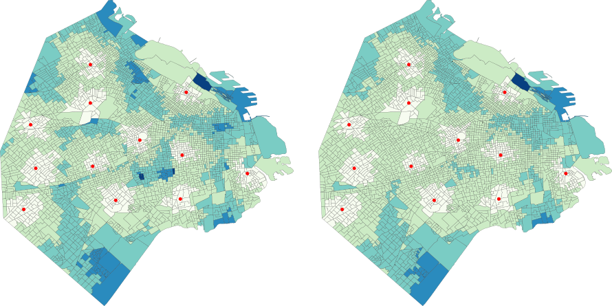
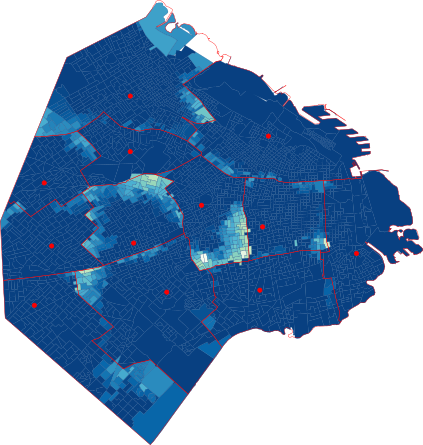

# 🚑 Google's routing service over hospital referral regions as a strategy to improve ambulances response time

_by_ Agustin Rodriguez (who thinks Google API calls are way too expensive, thankfully, He's got a coupon)

#### Summary

We compared ambulance response times from 3554 blocks of Buenos Aires City to an emergency hospital choose by either hospital referral regions (HRR) guidelines or Google's routing service through Google Maps. The latter accounts for distance and live traffic data, allowing the user to find the shortest and fastest route to each set of points at each given time of the day.

The overall improvement on the time that took to reach the target emergency hospital from each point of Buenos Aires City was 17 seconds (95CI: 13 - 22 seconds). 

A stratified analysis by the distance that each point has to its assigned emergency hospital inside the HRR showed that those places who benefit the most from switching to Google's selected emergency hospital where those farthest than 2 km away, with improvements going from one to two minutes in total.

When directing the analysis on those points where Google's selected emergency hospital did not match the assigned by the HRR, an improvement on response time of 109 seconds was observed (95CI 99 - 119).

Lastly, by switching strategies, the level of people with ambulance response time lesser than 10 minutes improved by 7% (95CI 5 - 10%), meaning 202,211 more people under the ten minutes line recommended  by emergencies organizations across the world. In conclusion, while a change of strategy may be suitable for some areas on Buenos Aires City, specially those on the periphery of their HRR, the overall improvement observed was negligible.

**Conflict of interest:**  I've got a coupon for 300$ to use in various Google cloud services.

## Figures

  

**Figure one:** Choropleth map showing Buenos Aires City colorized according to ambulance response time from each block to its assigned emergency hospital (red points). The figure on the left is consistent with response time using HRR assigned hospitals while the figure on the right shows response times using Google's routing service.

  

**Figure two:** Choropleth map showing Buenos Aires City colorized according to the time save by each block when using Google's routing service selected emergency hospital. Red dots show emergency hospital around the city while the red lines illustrate their referral regions. The lighter the color, the more time saved.

## License

This project is licensed under the Creative Commons Attribution 4.0 International (CC BY 4.0) license - see the [LICENSE.md](LICENSE.md) file for details.